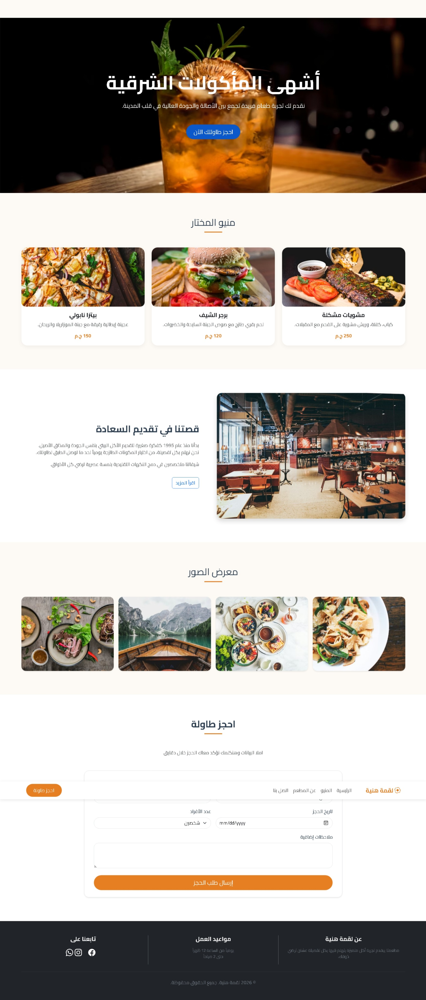

# Restaurant Landing Page

A modern and responsive restaurant landing page built using **HTML, CSS, Bootstrap and JavaScript**.  
The website is designed for restaurants and cafes to showcase their menu, gallery, and allow customers to reserve a table.

---

## 🚀 Features

- Modern restaurant UI design
- Fully responsive layout
- Smooth scrolling navigation
- Menu section with food items
- Image gallery section
- Table reservation form
- Clean and organized code structure

---

## 🛠 Technologies Used

- HTML5
- CSS3
- Bootstrap 5
- JavaScript
- Bootstrap Icons

---

## 📂 Project Structure
restaurant-landing-page/
│
├── index.html
│
├── css/
│ └── style.css
│
├── js/
│ └── script.js
│
└── img/
└── images used in the project 

---

## 📸 Sections Included

The landing page includes the following sections:

- Navigation Bar
- Hero Section
- Menu Section
- About Section
- Gallery Section
- Reservation Form
- Footer

---

## 🌐 Live Demo

The project can be viewed live using **GitHub Pages**.

Example link:
https://ragabcodes.github.io/restaurant-landing-page 

---

## 👨‍💻 Author

**Mohamed Ragab**

- GitHub: https://github.com/ragabcodes
- LinkedIn: https://www.linkedin.com/in/mohamed-r-ragab

Electrical Engineering Student and aspiring Full-Stack Web Developer focused on building modern websites and landing pages.

---

## 📄 License

This project is open-source and available for learning and portfolio purposes.

## Preview

